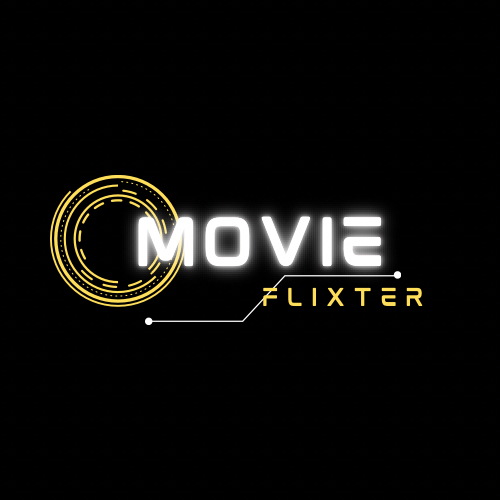

<div id="top"></div>
<!--
*** Thanks for checking out the Best-README-Template. If you have a suggestion
*** that would make this better, please fork the repo and create a pull request
*** or simply open an issue with the tag "enhancement".
*** Don't forget to give the project a star!
*** Thanks again! Now go create something AMAZING! :D
-->


<!-- PROJECT SHIELDS -->
<!--
*** I'm using markdown "reference style" links for readability.
*** Reference links are enclosed in brackets [ ] instead of parentheses ( ).
*** See the bottom of this document for the declaration of the reference variables
*** for contributors-url, forks-url, etc. This is an optional, concise syntax you may use.
*** https://www.markdownguide.org/basic-syntax/#reference-style-links
-->
[![Contributors][contributors-shield]][contributors-url]
[![Forks][forks-shield]][forks-url]
[![Stargazers][stars-shield]][stars-url]
[![Issues][issues-shield]][issues-url]
<!-- [![LinkedIn][linkedin-shield]][linkedin-url] -->


<!-- PROJECT LOGO -->
<br />
<div align="center">
  <a href="https://movieflixter.greywoulf1.repl.co/home">
    
  </a> 

<h3 align="center">MOVIEFLIXTER APPLICATION</h3>

  <p align="center">
    This project was for the creation of a group project creating a MVP Application that applied our knowledge of Routing, Navigation and Unit Tests. 
    <br />
<!--     <a href="https://github.com/LeagueOfPythoners/MovieFlixter"><strong>Explore the docs »</strong></a> -->
    <br />
    <br />
    <a href="https://movieflixter.greywoulf1.repl.co/home">View Demo</a>
    ·
    <a href="https://github.com/LeagueOfPythoners/MovieFlixter/issues">Report Bug</a>
    ·
    <a href="https://github.com/LeagueOfPythoners/MovieFlixter/issues">Request Feature</a>
  </p>
</div>


<!-- TABLE OF CONTENTS -->
<details>
  <summary>Table of Contents</summary>
  <ol>
    <li>
      <a href="#about-the-project">About The Project</a>
      <ul>
        <li><a href="#built-with">Built With</a></li>
      </ul>
    </li>
    <li>
      <a href="#getting-started">Getting Started</a>
      <ul>
        <li><a href="#prerequisites">Prerequisites</a></li>
        <li><a href="#installation">Installation</a></li>
      </ul>
    </li>
    <li><a href="#usage">Usage</a></li>
    <li><a href="#roadmap">Roadmap</a></li>
    <li><a href="#contributing">Contributing</a></li>
    <li><a href="#license">License</a></li>
    <li><a href="#contact">Contact</a></li>
    <li><a href="#acknowledgments">Acknowledgments</a></li>
  </ol>
</details>


<!-- ABOUT THE PROJECT -->
## About The Project


<p align="right">(<a href="#top">back to top</a>)</p>


### Built With

* [CSS](https://css.org/)
* [HTML5](https://html5.org/)
* [JavaScript](https://javascript.org/)
* [Django](https://www.djangoproject.com/)
* [Python3](https://www.python.org/)
* [Flask](https://flask.palletsprojects.com/en/2.2.x/)

<p align="right">(<a href="#top">back to top</a>)</p>


<!-- GETTING STARTED -->
## Getting Started

To get a local copy up and running follow these simple steps.

### Prerequisites

Install Python
  
Follow this link if installing python on VSCode: https://learn.microsoft.com/en-us/windows/python/beginners

### API Key/Token

1. Create an account on RapidApi
   https://rapidapi.com/
   
2. Subscribe to Flixter Api (for free)
   https://rapidapi.com/apidojo/api/flixster
   
### Installation

1. Clone the repo
   ```sh
   git clone https://github.com/LeagueOfPythoners/MovieFlixter.git
   ```
2. Install Django package
   ```sh
   python -m pip intall Django
   ```
3. Within the views.py file add the api key and host from RapidApi to the header
   ```sh
   headers = {
        'X-RapidAPI-Key': '4c34e8e909msh0182558b0376821p131673jsnd7c2614b3ae7',
        'X-RapidAPI-Host': 'flixster.p.rapidapi.com'
   }
   ```
4. Run Django Server
   ```
   python manage.py runserver
   ```
   
<p align="right">(<a href="#top">back to top</a>)</p>


## Deployed Application Link
https://movieflixter.greywoulf1.repl.co/home

Application can also be viewd by using the View Demo button at the top

<p align="right">(<a href="#top">back to top</a>)</p>


<!-- USAGE EXAMPLES -->
## Usage

This project is created as an MVP Application. It also has the opportunity for being used as a movie website template. 


<p align="right">(<a href="#top">back to top</a>)</p>


<!-- ROADMAP -->
## Roadmap

- [ ] Add registration page
- [ ] Add login page
- [ ] Add login/logout icons
- [ ] Update the style to be more modern


See the [open issues](https://github.com/LeagueOfPythoners/MovieFlixter/issues) for a full list of proposed features (and known issues).

<p align="right">(<a href="#top">back to top</a>)</p>


<!-- CONTRIBUTING -->
## Contributing

Contributions are what make the open source community such an amazing place to learn, inspire, and create. Any contributions you make are **greatly appreciated**.

If you have a suggestion that would make this better, please fork the repo and create a pull request. You can also simply open an issue with the tag "enhancement".
Don't forget to give the project a star! Thanks again!

1. Fork the Project
2. Create your Feature Branch (`git checkout -b feature/AmazingFeature`)
3. Commit your Changes (`git commit -m 'Add some AmazingFeature'`)
4. Push to the Branch (`git push origin feature/AmazingFeature`)
5. Open a Pull Request

<p align="right">(<a href="#top">back to top</a>)</p>


<!-- LICENSE -->
## License

License under the MIT License. See `LICENSE.txt` for more information.

<p align="right">(<a href="#top">back to top</a>)</p>


<!-- CONTACT -->
## Contact

Your Name - [LeagueOfPythoners](https://twitter.com/twitter_handle) - email@email_client.com

Project Link: [https://github.com/LeagueOfPythoners/MovieFlixter](https://LeagueOfPythoners/MovieFlixter)

<p align="right">(<a href="#top">back to top</a>)</p>


<!-- GitHub Stats  -->

## Github Stats
[](https://github.com/greywoulf)

[](https://github.com/greywoulf)

[](https://github.com/carla-day)

[](https://github.com/carla-day)


<!-- ACKNOWLEDGMENTS -->
## Acknowledgments

For inspiration, images and code snippets used in the creation of this website.

* [Canva](https://www.canva.com/templates/)


<p align="right">(<a href="#top">back to top</a>)</p>


<!-- MARKDOWN LINKS & IMAGES -->
<!-- https://www.markdownguide.org/basic-syntax/#reference-style-links -->
[contributors-shield]: https://img.shields.io/github/contributors/LeagueOfPythoners/MovieFlixter.svg?style=for-the-badge
[contributors-url]: https://github.com/LeagueOfPythoners/MovieFlixter/graphs/contributors
[forks-shield]: https://img.shields.io/github/forks/LeagueOfPythoners/MovieFlixter.svg?style=for-the-badge
[forks-url]: https://github.com/LeagueOfPythoners/MovieFlixter/network/members
[stars-shield]: https://img.shields.io/github/stars/LeagueOfPythoners/MovieFlixter.svg?style=for-the-badge
[stars-url]: https://github.com/LeagueOfPythoners/MovieFlixter/stargazers
[issues-shield]: https://img.shields.io/github/issues/LeagueOfPythoners/MovieFlixter.svg?style=for-the-badge
[issues-url]: https://github.com/LeagueOfPythoners/MovieFlixter/issues
[license-shield]: https://img.shields.io/github/licenseLeagueOfPythoners/MovieFlixter.svg?style=for-the-badge
[license-url]: https://github.com/LeagueOfPythoners/MovieFlixter/blob/briana/LICENSE.txt
[linkedin-shield]: https://img.shields.io/badge/-LinkedIn-black.svg?style=for-the-badge&logo=linkedin&colorB=555
[linkedin-url]: https://linkedin.com/in/linkedin_username
[product-screenshot]: images/screenshot.png
